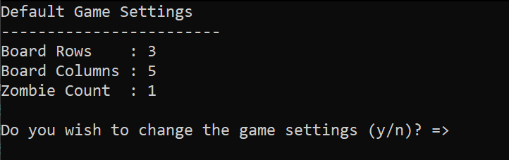
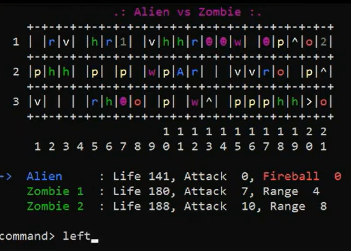
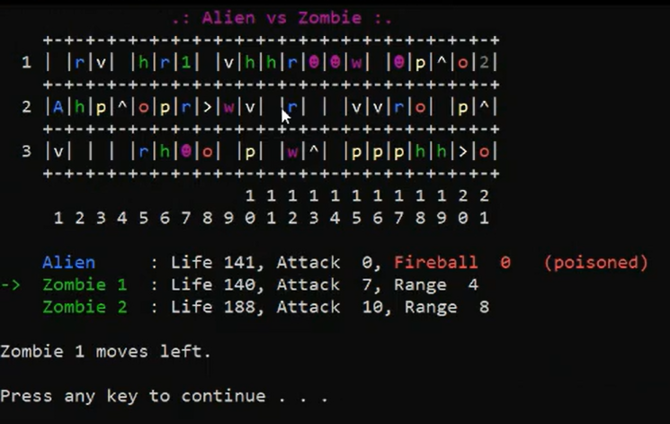
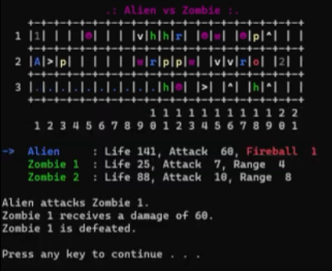
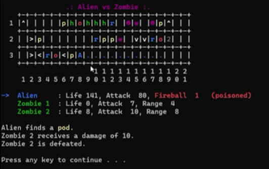
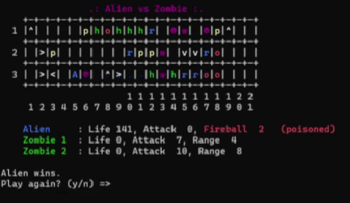
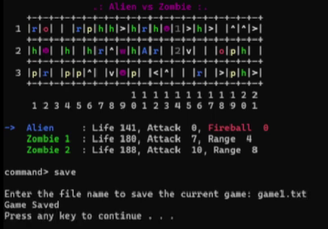

# __Alien vs. Zombie__

Alien vs Zombie is a turn-based combat game in which the player controls Alien to defeat a group of Zombies. Prior to the game, the player can customize settings including game board dimensions and number of zombies.


[Video Demo](https://youtu.be/gK5mI_Cnfos).

## __Compilation Instructions__

To compile the program, run<br> 
```g++ pf\*.cpp zombie\*.cpp col\*.cpp alien\*.cpp cmd\*.cpp main.cpp```

<br />

## __User Manual__

Before we dive into the fun part on how to play the game, let's first understand how each characters and objects functions work :sunglasses:

### __1.1 Game Characters__
#### 1.1.1 Alien (A) 
   - Share 2 common attributes: life and attack
   - Alien is defeated when its life becomes zero
   - Placed at the center of the gameboard

#### 1.1.2 Zombies (Represented by numbers 1-9)
   - Contain 3 attributes: life, attack and range
   - Randomly located in the gameboard  

<br />

### __1.2 Movement and attack__
#### 1.2.1 Alien
   - Move only 4 directions (up/down/left/right)
   - When encounter the following events, the alien would stop and its turn ends:
      1. Hits the border of the game board
      2. Hits the Rock object
      3. Hits and attacks Zombie, but Zombie survives the attack.

#### 1.2.2 Zombie
   - Zombie can only move 1 step in a randomly selected direction (up, down, left, or right). 
   - Zombie can only move to the location not occupied by alien
   - If Zombie is defeated by the alien attack, zombie will be removed from the game board while alien continues to move

<br />

### __1.3 Game objects__
|   Objects     |        Function
|---|---|
| 1. Health (h)  |   Adds 20 life to alien
| 2. Pod \(p\)      |   Instantly inflicts 10 damage to Zombie when hit by Alien
| 3. Rock \(r\)    |    - Hides a game object (except Rock and Trail) beneath it.<br> - Reveals the hidden game object when hit by Alien.<br> - Stops the Alien from moving.
| 4. Arrow<br> (^/V/>/<)     |   - Changes Alien’s direction of movement.<br> - Adds 20 attack to Alien.

<br />

### __1.4. Help Command__
User can type the "help" command in which it will show all the available commands supported. Below are the details of the command fuunction

|   Command      |        Description
| --- | --- |
| 1. up          |   Alien to move up.
| 2. down        |   Alien to move down.
| 3. left        |   Alien to move left.
| 4. right       |   Alien to move right.
| 5. arrow       |   Switch the direction of an arrow object in the game board.<br> (The player will be asked to enter the row and column of the arrow object to switch, followed by the direction of the arrow object to switch to)
| 6. help        |   List and describe the commands that the player can use in the game.
| 7. save        |   Save the current game to a file.<br> (The player will be asked to enter the name of the file to save to)
| 8. load        |   Load a saved game from a file.<br> (The player will be asked to enter the name of the file to load from)
| 9. quit        |   Quit the game while still in play.   

<br />

# __Getting Started__
Below is the complete demonstration on how the game works. Try it out and enjoy Alien Vs Zombie game to the fullest extent!

### __1. Game Settings__

   <br />The program would start of with a default game settings containing 3 rows, 5 columns and 1 zombie. User will be prompted if they wish to change the settings, user will have to type "y" or "n". If they type "n", they will be redirect to the gameboard with the default settings, while if they type "y", they will be asked to enter the rows, columns and number of zombies they wish to display. The user could only enter odd number values for the board dimensions. In the case where they enter even number values, they will be prompted to re-enter again.

<br />

### __2. Game Dashboard__

   <br />Next, it will shows a game dashboard which is created according to the rows and columns specified by the user. Below the gameboard, we have the game characters display which is the alien, as well as the zombies. The arrow on the left of the alien is used to indicate which characters turn is active. The gameboard is randomly generated with objects in which it contains: Health(h), Pod(p), Rock(r), Arrow(^/V/>/<) (For more information, Refer to [Section 1.3](#13-game-objects) on how the object functions) 

<br />

### __3. Alien Movement & Health Object__

   <br />As you can see from the above demonstration, the arrow on the left of the alien indicate that its the alien turn, user can either type "left", "right", "up" or "down" to move the Alien. In this condition, user type in "left" to move the alien to the left. 
   

   <br />The alien encounters a health pack. The health pack will add 20 life to the alien. If the alien already reaches its maximum health, there is no increment in the health anymore. In this case, the alien's health will not be increasing as the alien's health is already reaches its full capacity. 
   </br>


   <br/>Now let's continue to move. As the alien moves, it will leave a trail behind him (represented by a "."), this indicates that the alien has travelled that path before. Alien finds an empty space and it continues to move.
   
<br/>

### __4. Pod Object__

   <br/>This time alien encounters a pod object. The pod would attack the nearest zombie which in this case is zombie 1. Zombie 1 receives a damage of 10 and its life is now decrement to 102. However zombie 1 survives. Therefore, the alien would continue to move.
   
<br/>

### __5. Arrow Object__

   <br/>Now the alien encounters a "v" arrow which indicate moving downwards, the arrow could add 20 attack points to the alien. In this situation, the alien could make use of the arrow object to attack zombie 1 which is located right below the arrow. 


   <br/>It's time to attack zombie 1!! As you can see, zombie 1 receives a damage of 20 and its life is decreased to 82. However zombie 1 is still alive.


   <br/>As mentioned earlier in [Section 1.2](#12-movement-and-attack), the alien would stop when the zombie survives the attack from the alien. Alien's turn would end and it's now switch to Zombie 1's turn.

<br/>

### __6. Zombie 1's Movement and Attack__

   <br/>Now its Zombie 1's turn. Zombie 1 moves 1 step to the left. As you can notice here, the alien's trail, represented by a ".", is now reinitialised to new game objects.


   <br/>Alien is in danger! As alien is within the range of zombie 1 which in this case is 5, zombie 1 could attack the alien. Alien receives a damage of 11 and it is still alive. 
   
<br/>

### __7. Zombie 2's Movement__

   <br/>As you can see, alien's life is now decreased to 130 and it's turn is switch to zombie 2. Zombie 2 chooses to moves right.


   <br/>In this case zombie 2 could only attack the alien if its within the range of 8. Since the alien is too far from the zombie's range, zombie 2 is unable to attack alien. Therefore Zombie 2's turn ends and will move on to the alien again.
   
<br/>

### __8. Rock Object__

   <br/>Let's discover what will happen when the alien stumbles upon a rock. In this situation, Alien moves up and encounters a rock. As previously mention in [section 1.3](#13-game-objects), the rock reveals a hidden game object when hit by alien. It discovers nothing beneath the rock. The alien would stop and its turn ends. 

<br/>

### __9. Arrow Commands__

    <br/>Introducing the arrow commands! Now let's say you want to move the alien to go down, you could use the arrow command which will prompt the user to type in the arrow rows, columns and the directions they wish to change for. For this situation, we wanted to change the arrow direction for row 2 column 3 to down, we could type "2 3 down" to change the arrow direction. Tada! The arrow is now changed to down and alien could move to the targeted zombie again. 
   

    <br/>As you can see, alien accumulated an attack of 40 which is enough to kill zombie 1. Now it's time to kill zombie 1!


    <br/>As you can see, zombie 1 is defeated and its life became 0, it is now removed from the gameboard. Now let's target to kill zombie 2! In order to get to zombie 2, we will have to change the arrow direction at row 1 column 16 to the left. 
   

    <br/>Now all the directions have been change to direct to zombie 2 and off we go to kill the zombies!! As you can see, alien accumulate an attack of 40 and is enough to kill zombie 2. Zombie 2 is now defeated with its life becoming 0.

<br />

### __10. Winner__

   <br/>Now all the zombies have been defeated, alien wins!!!  
   
<br />

### __11. Play Again__

   <br/>Notice that there is a prompt to ask the user if they want to play again or not. If the user type in "n", the game would automatically quit. In this case the user wanted to play again, the user would have to type "y", the game would show another different gameboard with the same attributes values as the previous game for alien and zombies.

<br />

### __12. Save Game__

   <br/>In the case when the user wanted to save the game and play next time, they could type "save" and the program would prompt the user to enter a file name to save the current game. The file name that the user enter must be in a text based file format. Let's type "game1.txt" to save the game. Now the game is saved to your computer. So what to do if next time we wanted to play the game that we saved?

<br />

### __13. Load Game__

   <br/>To open the game that we have saved, we could type "load" in the command and the program would ask the user if they want to save the current game. Let's say the user enter "n" for no,  the program would ask the user to enter the file name to load, let's enter the file name, "game1.txt" that we have saved just now, notice that the program automatically updates the gameboard that we have saved earlier. 

<br />

### __14. Quit__

   <br/>Now came the question on how can the user quit the game? Type "quit" and the game will automatically quits the program. That's the end of the game demonstration. Now you know how to play it, dive in and have fun in it.

## __Progress Log__

- [Part 1](PART1.md)
- [Part 2](PART2.md)

## __Contributors__

- Chay Wen Ning
- Melody Koh Si Jie