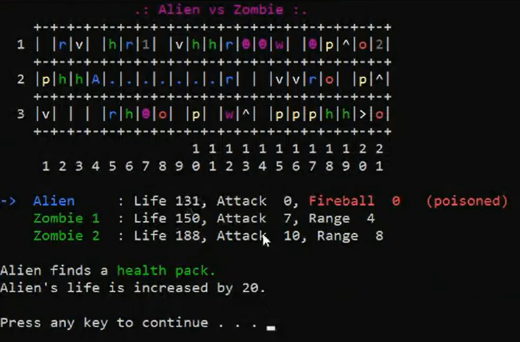
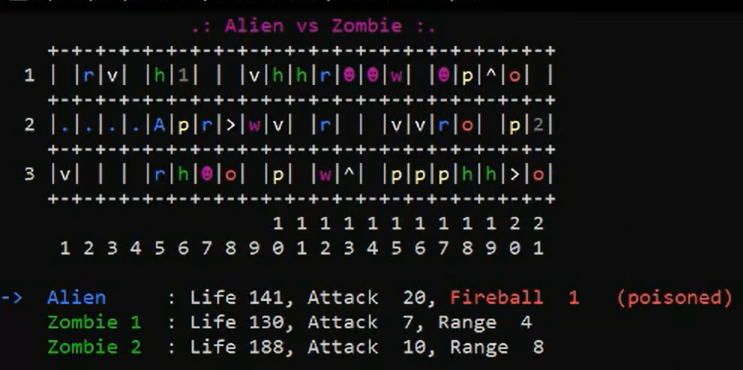
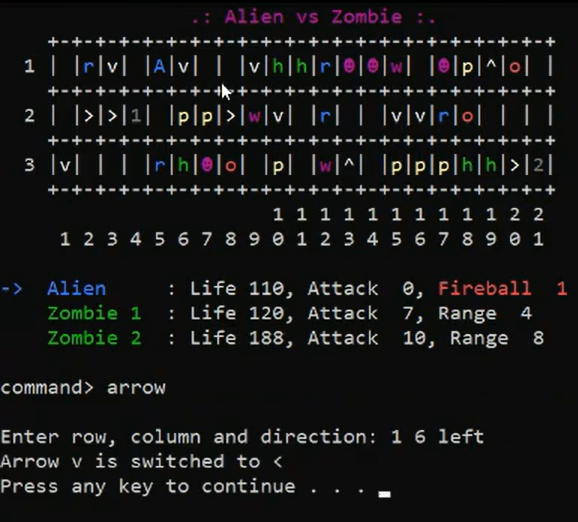
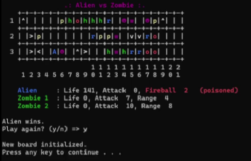

# __Alien vs. Zombie__

Alien vs Zombie is a turn-based combat game in which the player controls Alien to defeat a group of Zombies. Prior to the game, the player can customize settings including game board dimensions and number of zombies.


[Video Demo](https://youtu.be/1kf7NFHZ_9k).

## __Compilation Instructions__

To compile the program, run<br> 
```g++ pf\*.cpp zombie\*.cpp col\*.cpp alien\*.cpp cmd\*.cpp hangman\*.cpp main.cpp```

<br />

## __User Manual__

Before we dive into the fun part on how to play the game, let's first understand how each characters and objects functions work :sunglasses:

### __1.1 Game Characters__
#### 1.1.1 Alien (A) 
   - Color code is blue
   - Share 2 common attributes: life and attack
   - Alien is defeated when its life becomes zero
   - Placed at the center of the gameboard

#### 1.1.2 Zombies (Represented by numbers 1-9)
   - Color code is green
   - Contain 3 attributes: life, attack and range
   - Randomly located in the gameboard  

<br />

### __1.2 Movement and attack__
#### 1.2.1 Alien
   - Move only 4 directions (up/down/left/right)
   - When encounter the following events, the alien would stop and its turn ends:
      1. Hits the border of the game board
      2. Hits the Rock object
      3. Hits and attacks Zombie, but Zombie survives the attack.
      4. Encounters Hangman object and lose the game

#### 1.2.2 Zombie
   - Zombie can only move 1 step in a randomly selected direction (up, down, left, or right). 
   - Zombie can only move to the location not occupied by alien
   - If Zombie is defeated by the alien attack, zombie will be removed from the game board while alien continues to move

<br />

### __1.3 Game objects__
|   Objects     |        Function
|---|---|
| 1. Health (h)  |   Adds 20 life to alien
| 2. Pod \(p\)      |   Instantly inflicts 10 damage to Zombie when hit by Alien
| 3. Rock \(r\)    |    - Hides a game object (except Rock and Trail) beneath it.<br> - Reveals the hidden game object when hit by Alien.<br> - Stops the Alien from moving.
| 4. Arrow<br> (^/V/>/<)     |   - Changes Alien’s direction of movement.<br> - Adds 20 attack to Alien.
| 5. Fireball \(o\)     |   - Deals with a 3x3 area of explosion, damaging zombie in range by 5
| 6. Witch \(w\)     |   - Poison the alien with a damage of 10 for 3 rounds.<br> - Adds 10 attack to the zombie.
| 7. Hangman \(☻\)     |   - Prompt and ask the user to guess a word. (optional)<br> - If user wins, hangman will either heal player or attack zombie as reward <br> - If user lose, alien has to end turn as punishment

<br />

### __1.4. Help Command__
User can type the "help" command in which it will show all the available commands supported. Below are the details of the command fuunction

|   Command      |        Description
| --- | --- |
| 1. up          |   Alien to move up.
| 2. down        |   Alien to move down.
| 3. left        |   Alien to move left.
| 4. right       |   Alien to move right.
| 5. fireball    |   Alien deals explosion with fireball.
| 6. arrow       |   Switch the direction of an arrow object in the game board.<br> (The player will be asked to enter the row and column of the arrow object to switch, followed by the direction of the arrow object to switch to)
| 7. help        |   List and describe the commands that the player can use in the game.
| 8. save        |   Save the current game to a file.<br> (The player will be asked to enter the name of the file to save to)
| 9. load        |   Load a saved game from a file.<br> (The player will be asked to enter the name of the file to load from)
| 10. quit       |   Quit the game while still in play.   

<br />

# __Getting Started__
Below is the complete demonstration on how the game works. Try it out and enjoy Alien Vs Zombie game to the fullest extent!

### __1. Default Game Settings__

   <br />The program would start of with a default game settings containing 3 rows, 5 columns and 1 zombie. User will be prompted if they wish to change the settings, user will have to type "y" or "n". If they type "n", the program will change to another screen with the gameboard consist of the default settings, in this case let's assume user type "y", they will be redirected to another screen.

<br />

### __2. Change Game Settings__


   <br />Here the program will ask the user to enter the rows, columns and number of zombies they wish to display. The user could only enter odd number values for the board dimensions. In the case where they enter even number values, they will be prompted to re-enter again. Now let's say we want to have 3 rows 21 columns and 2 zombies. The program will display that the settings have been updated.

<br />

### __3. Game Dashboard__

   <br />Welcome to the world of alien and zombies!! In front of you is a game dashboard which is created according to the rows and columns specified by the user. Below the gameboard, we have the game characters display which is the alien (represented by blue), as well as the zombies (represented by green). The arrow on the left of the alien is used to indicate which characters turn is active. If the arrow is in blue color, this indicates that the alien's turn is active. Otherwise if its green, then its the zombie turn's. The gameboard is randomly generated with objects, each with different color, in which it contains: Health(h), Pod(p), Rock(r), Arrow(^/V/>/<), Witch(w), Fireball(o) and Hangman(☻) (For more information, Refer to [Section 1.3](#13-game-objects) on how the object functions) 

<br />

### __4. Alien Movement__

   <br />As you can see from the above demonstration, the arrow on the left of the alien is blue, indicating that the alien's turn is active, user can either type "left", "right", "up" or "down" to move the Alien. In this condition, user type in "left" to move the alien to the left. 

<br/>
   
### __5. Pod Object__

   <br />
   The alien encounters a pod object. The pod would attack the nearest zombie which in this case is zombie 1. As zombie 1 is nearer to the pod than zombie 2, zombie 1 receives a damage of 10. 
   </br>


   <br/>Zombie 1's life is now decrement to 170. However zombie 1 survives. Therefore, the alien would continue to move. As the alien moves, it will leave a trail behind him (represented by a blue "."), this indicates that the alien has travelled that path before.

<br/>

### __6. Witch Object__

   <br />Oh no! This time alien encounters a witch. The witch poisons the alien and alien receives a damage of 10 for 3 rounds, the total accumulated damage is 30. 
   <br/>

  
   As you can see, the alien's life is decreased by 10 and now becomes 131, the poisoned word with red is shown beside the alien to indicate that the alien has got poisoned. Let's continue to move.

<br />

### __7. Health Object__

   <br/>
   This time the alien encounters a health pack. The health pack will add 20 life to the alien. In the case when the alien already reaches its maximum health, there is no increment in the health anymore. 


   <br/>In this case, the alien's health will be increase up to 10 only as the alien's health is already reaches its full capacity. The alien's life now updates to 141. Now the alien continues to move.
   

   <br/>Alien encounters the border. As mentioned in [Section 1.2.1](#12-movement-and-attack), alien would stop and its turn would end. The alien's trail, represented by a ".", is now reinitialised to new game objects.

<br/>

### __8. Zombie 1's Movement__

   <br/>Now its Zombie 1's turn. As you can see the arrow beside zombie 1 is now turn to green , this indicate zombie 1's turn is active. Not only that, the character "1" inside the board has turned from grey to green color, so zombie 1 is active. Zombie 1 moves 1 step to the left. 


   <br/>In this case zombie 1 could only attack the alien if its within the range of 4. Since the alien is too far from the zombie's range, zombie 1 is unable to attack alien. Therefore Zombie 1's turn ends and will move on to zombie 2.

<br/>

### __9. Zombie 2's Movement__

   <br/>Now its Zombie 2's turn. Zombie 2 moves down. Notice that the zombie 2 character in the gameboard is now switched to green color and zombie 1 character now turns grey color. This indicate that zombie 2 is active. 


   <br/>In this case zombie 2 could only attack the alien if its within the range of 8. Since the alien is too far from the zombie's range, zombie 2 is unable to attack alien. Therefore Zombie 2's turn ends and will move on to the alien again.

<br/>

### __10. Alien got poisoned 2nd Round__

   <br/>As for now you can see its the alien turns again, before the alien moves, alien got poisoned from the witch for the 2nd round and receives a damage of 10, the poisoned word is still there indicating the alien got poisoned. Therefore alien's life will decrease to 131.

<br/>

### __11. Arrow Object__

   <br/>Alien continues to move and it encounters a ">" arrow which indicate moving right, the arrow could add 20 attack points to the alien. 

<br/>

### __12. Fireball Object__


   <br/>So for now alien moves to the left and it finds a fireball. The fireball count is increased to 1. Have you ever wondered how does the fireball object function? Let's proceed to find out.


   <br/>To call the fireball commmand, simply type ```fireball``` into the command prompt. The game will then ask the for the row and column of the board to shoot the fireball at. Let's say we want to attack zombie 1, so we shoot a fireball at row 1, column 4, which deals 5 damage to zombie 1. What happens next?


   <br/>After shooting a fireball, the number of fireball will decrease by 1. As we can see, the game objects that were previously within the range of the explosion has been destroyed, and replaced with trails.


   <br/>When Alien has zero fireball, calling the fireball command will display a message saying "Alien do not have any fireball to shoot". Try getting more fireballs first.

<br/>

### __13. Rock Object__

   <br/>Now let's discover what will happen when the alien stumbles upon a rock. In this situation, Alien moves left and encounters a rock. As previously mention in [section 1.3](#13-game-objects), the rock reveals a hidden game object when hit by alien. It discovers a pod beneath the rock. 


   <br/>The rock object has now turned into a pod. As mentioned in [Section 1.2.1](#12-movement-and-attack), when the alien encounters a rock object, alien would stop and its turn would ends. 

<br/>

### __14. Hangman Object (Win)__

   <br/>Did you notice a purple face in the board? Introducing our new implemeted object, the hangman! When the alien encounters hangman, the user will have to choose if they want to play hangman or not. Let's say in this case we want to play hangman, so we will type in "y", the user have to guess a word now.
   


   <br/>The user guess it correctly! The word is ```patent```. As mentioned in [Section 1.3](#13-game-objects) if the user wins the hangman, hangman will either heal the player or attack zombie as a reward. If the user lose, alien has to end turn as a punishment. In this case, the user won and the hangman heals alien by 10 health.


   <br/>As you can see, the hangman's life is increased by 10. After winning the hangman game, the hangman will leave from the gameboard and alien can continue to move.

<br/>

### __15. Hangman Object (Lose)__

   <br/>Now in this case the user failed to guess a word, so as a punishment, alien's turn will end and will switch on to zombie 1's turn. Hangman left.

<br/>

### __16. Zombie 1's Attack__


   <br/>As for now it's zombie 1 turn and zombie 1 choose to move to the left. Alien is in danger! As alien is within the range of zombie 1 which in this case is 4, zombie 1 could attack the alien. Alien receives a damage of 7 and it is still alive. 
   
<br/>

### __17. Alien got poisoned 3rd Round__

   <br/>Now let's fast forward to the alien's turn. This time alien got poisoned from the witch for the 3rd round and receives a damage of 10, the poisoned word is still there indicating the alien got poisoned. Therefore alien's life will decrease to 124. Let's skip ahead to the alien's 4th round.

<br/>

### __18. Alien is no longer poisoned__


   <br/>So for the 4th round, you can observe that alien is no longer poisoned and the "poisoned" word has been removed.

<br/>

### __19. Arrow Commands__

    <br/>Now let's say the alien wants to attack zombie 1 which is located at row 2 column 4, we could make use of the arrow object to attack the zombie, the user wanted to collect 60 attack points to attack the zombie. How can the user does that? Introducing the arrow commands! You could use the arrow command which will prompt the user to type in the arrow rows, columns and the directions they wish to change for. For this situation, we want to change the arrow direction for row 1 column 6 from down to left, we could type "1 6 left" to change the arrow direction. 
    

    <br/>Tada! The arrow is now changed to left and alien could move to the targeted zombie again. 
   
<br/>

### __20. Alien attack zombie 1__

   <br/>It's time to attack zombie 1!! As you can see, alien moves to the right and the right arrow that we have changed just now directed the alien to the left in which the alien collected an accumulated attack of 40. 
   

   <br/>Next alien follows the arrow direction to moves down and the total accumulated attack point is now turned to 60. Off we go to attack zombie 1! Zombie 1 receives a damage of 60 and its life is decreased to 60. However zombie 1 is still alive. As mentioned earlier in [Section 1.2.1](#12-movement-and-attack), the alien would stop when the zombie survives the attack from the alien. Alien's turn would end and it's now switch to Zombie 2's turn.

<br/>

### __21. Kill zombies__

    <br/>Alien has successful to defeat zombie 1! As you can see, zombie 1 is defeated and its life became 0, it is now removed from the gameboard. Now let's defeat zombie 2 using pods!
   

    <br/> As mentioned in [Section 5](#5-pod-object), the pod will deal a damage of 10 to its closest zombie. Since zombie 2 is the only zombie left, all pod damage will be inflicted on it. As you can see, alien finds a pod and damages zombie 2 by 10, which is enough to kill zombie 2. Zombie 2 is now defeated with its life becoming 0.

<br />


### __22. Winner__

   <br/>Now all the zombies have been defeated, alien wins!!!  
   
<br />

### __23. Play Again__

   <br/>Notice that there is a prompt to ask the user if they want to play again or not. If the user type in "n", the game would automatically quit. In this case the user wanted to play again, the user would have to type "y", the game would show another different gameboard with the same attributes values as the previous game for alien and zombies.

<br />

### __24. Save Game__

   <br/>In the case when the user wanted to save the game and play next time, they could type "save" and the program would prompt the user to enter a file name to save the current game. The file name that the user enter must be in a text based file format. Let's type "game1.txt" to save the game. Now the game is saved to your computer. So what to do if next time we wanted to play the game that we saved?

<br />

### __25. Load Game__


   <br/>To open the game that we have saved, we type "load" in the command and the program would ask the user if they want to save the current game. Let's save another game called "game2.txt". After saving a new game, the program would ask the user to enter the file name to load. Now let's enter the first "game1.txt" that we saved earlier. Notice that the program automatically updates the gameboard that we have saved earlier. 

<br />

### __26. Quit__

   <br/>Now comes the question, how can the player quit the game? By typing the "quit" command, the game will automatically quits the program. That's the end of the game demonstration. Now that you know how to play it, dive in and have fun with it.

## __Progress Log__

- [Part 1](PART1.md)
- [Part 2](PART2.md)

## __Contributors__

- Chay Wen Ning
- Melody Koh Si Jie